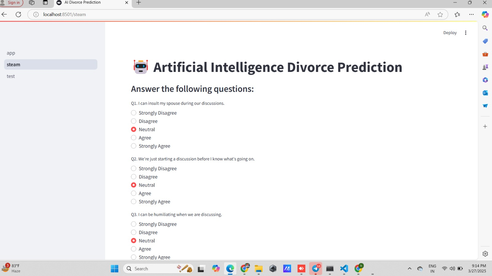
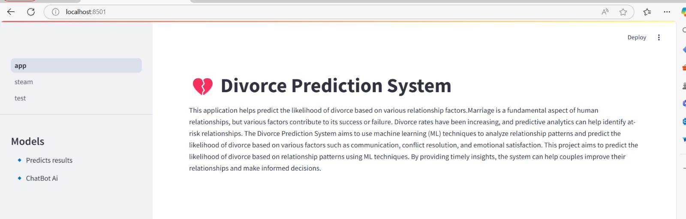
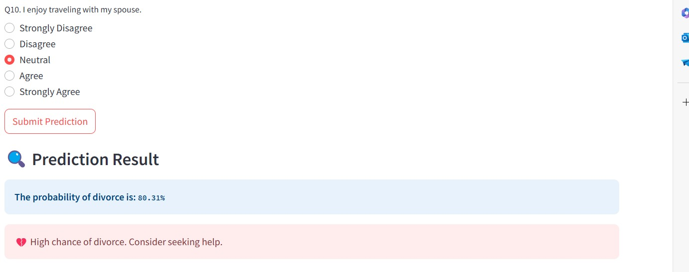
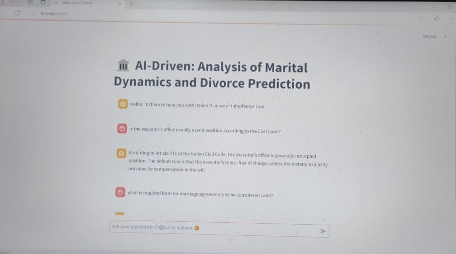

# Marital Status Prediction using Survey Responses

This project focuses on predicting an individual's marital status (Married or Divorced) based on their responses to a series of psychological and behavioral questions. The dataset was sourced from the [UCI Machine Learning Repository](https://archive.ics.uci.edu/), containing structured answers collected via Google Forms or similar methods.

## 📊 Dataset Overview

- **Rows (Samples):** 170
- **Columns (Features):** 54 survey response features + 1 target column
- **Input Format:** Each feature represents a response to a question with options ranging from:
  - `0` - Strongly Disagree  
  - `1` - Disagree  
  - `2` - Neutral  
  - `3` - Agree  
  - `4` - Strongly Agree  

- **Target Variable:**
  - `0` = Married  
  - `1` = Divorced

## 🎯 Objective

To build a machine learning model that can accurately predict a person's marital status based on their questionnaire responses.

## 🧠 Models Used

*(Update this section based on your implementation)*

- Logistic Regression
- Decision Tree
- Random Forest
- Support Vector Machine
- XGBoost

## 📈 Evaluation Metrics

Common classification metrics used:
- Accuracy
- Precision
- Recall
- F1 Score
- ROC-AUC Score

## 🤖 LLM Chatbot Integration

This project also includes an **LLM-powered chatbot** that allows users to ask questions about the model, dataset, or their predictions in natural language. It serves as an intuitive interface to understand the logic behind predictions and explore the data interactively.

